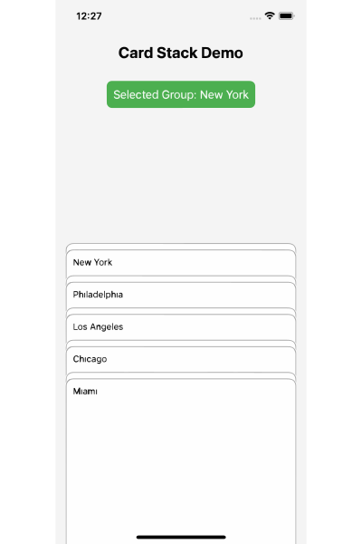

# react-native-wallet-card-stack

A customizable React Native component for displaying animated stacks of card groups. Each group scrolls with smooth animations, and within each group, up to 3 cards are stacked with their own animation effects. Ideal for creating visually engaging card-based UIs like wallets, galleries, or dashboards.



<br><br>

### Check out the `CardStack` component in action:

[Demo Video](https://www.youtube.com/shorts/y9ets6PTXmY)

## Note :

The whole card stack moving animation currently only works smoothly on iOS.

# Features

- **Animated Scrolling**: Card groups animate as you scroll, with the entire stack shifting based on a configurable top offset.

- **Customizable**: Adjust card height, padding, spacing, and more via props.

- **Group Limit**: Automatically limits each group to a maximum of 3 cards.

- **TypeScript Support**: Fully typed for better developer experience.

## Installation

Install the package via npm:

npm install react-native-card-stack

Or with yarn:

yarn add react-native-card-stack

### Dependencies

Ensure you have the following peer dependencies installed:

- react

- react-native

## Usage

Here’s a basic example of how to use CardStack in your React Native app:

    import React from 'react';
    import { SafeAreaView, StyleSheet, Text, View } from 'react-native';
    import CardStack from 'react-native-card-stack';

    // Sample data for the card stack: array of card groups
    const demoData = [
      [
        { id: 1, title: 'Card 1', description: 'Description for card 1' },
        { id: 2, title: 'Card 2', description: 'Description for card 2' },
      ],
      [
        { id: 3, title: 'Card 3', description: 'Description for card 3' },
        { id: 4, title: 'Card 4', description: 'Description for card 4' },
        { id: 5, title: 'Card 5', description: 'Description for card 5' },
      ],
    ];

    // Main App component
    const App = () => {
      // State to track the selected card group
      const [selectedGroup, setSelectedGroup] = React.useState(null);

      return (
        <SafeAreaView style={styles.container}>
          {/* Header text */}
          <Text style={styles.header}>Card Stack Demo</Text>
          {/* Display selected group info */}
          <View style={styles.info}>
            <Text>
              {selectedGroup !== null ? `Selected Group: ${selectedGroup + 1}` : 'Tap a group to select'}
            </Text>
          </View>
          {/* Spacer to push CardStack down */}
          <View style={styles.spacer} />
          {/* CardStack component with props */}
          <CardStack
            data={demoData}
            renderCard={(item) => (
              <View style={styles.card}>
                <Text style={styles.title}>{item.title}</Text>
                <Text>{item.description}</Text>
              </View>
            )}
            cardHeight={400}        // Height of each card
            cardPadding={50}        // Padding between card groups
            cardSpace={10}          // Space between cards in a group
            topOffset={200}         // Animation trigger offset from top
            onCardPress={(groupIndex) => setSelectedGroup(groupIndex)} // Handle group selection
          />
        </SafeAreaView>
      );
    };

    // Styles for the app
    const styles = StyleSheet.create({
      container: { flex: 1 },                     // Full-screen container
      header: {
        fontSize: 24,
        fontWeight: 'bold',
        textAlign: 'center',
        padding: 20
      },                                          // Styled header text
      info: {
        padding: 10,
        alignItems: 'center'
      },                                          // Centered info text container
      spacer: { height: 200 },                    // Spacer for layout
      card: {
        padding: 15,
        backgroundColor: '#fff',
        borderRadius: 8,
        height: '100%'
      },                                          // Card styling
      title: {
        fontSize: 20,
        fontWeight: 'bold',
        marginBottom: 5
      },                                          // Card title styling
    });

    export default App;

## Props

SmartyPants converts ASCII punctuation characters into "smart" typographic punctuation HTML entities. For example:

## Props

| Prop                 | ASCII Type                                                        | ASCII Default                                         | Description                                                                    |
| -------------------- | ----------------------------------------------------------------- | ----------------------------------------------------- | ------------------------------------------------------------------------------ |
| `data`               | `T[][]`                                                           | Required                                              | Array of card groups, where each group is an array of card data objects.       |
| `renderCard`         | `(item: T, groupIndex: number, cardIndex: number) => JSX.Element` | Required                                              | Function to render each card, receiving the item, group index, and card index. |
| `cardHeight`         | `number`                                                          | `400`                                                 | Height of each card in pixels.                                                 |
| `cardPadding`        | `number`                                                          | `57`                                                  | Padding between card groups in the animation.                                  |
| `cardSpace`          | `number`                                                          | `6`                                                   | Space between cards within a group in the animation.                           |
| `topOffset`          | `number`                                                          | `Dimensions.get('window').height * 0.35`              | Top offset for the stack animation trigger.                                    |
| `keyExtractor`       | `(item: T[], groupIndex: number) => string`                       | `(item, index) => ${index}`                           | Key extractor for card groups.                                                 |
| `cardKeyExtractor`   | `(item: T, cardIndex: number, groupIndex: number) => string`      | `(item, index, groupIndex) => ${groupIndex}-${index}` | Key extractor for cards within a group.                                        |
| `onCardPress`        | `(groupIndex: number) => void`                                    | `undefined`                                           | Callback when a card group is pressed, receives the group index.               |
| `flatListProps`      | `Partial<FlatListProps<T[]>>`                                     | `undefined`                                           | Additional props for the outer FlatList.                                       |
| `innerFlatListProps` | `Partial<FlatListProps<T>>`                                       | `undefined`                                           | Additional props for the inner FlatList (per group).                           |

```

```
